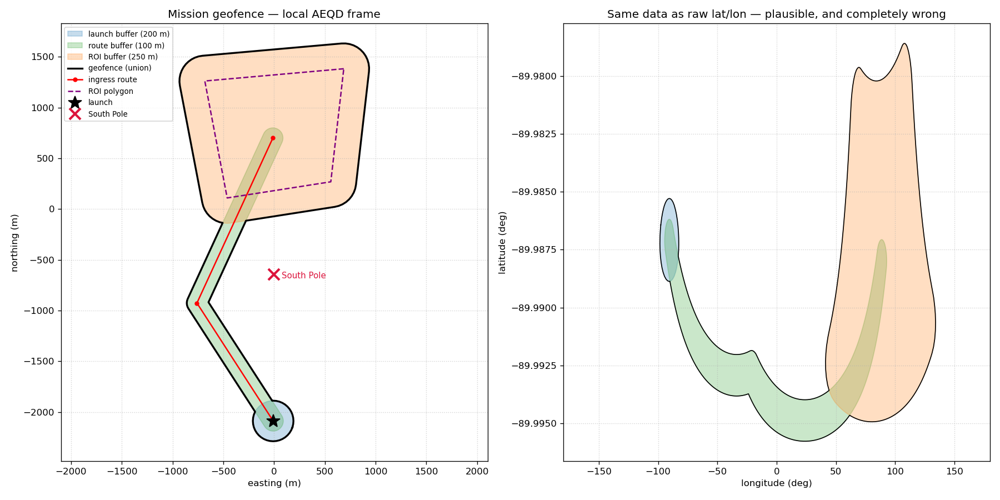
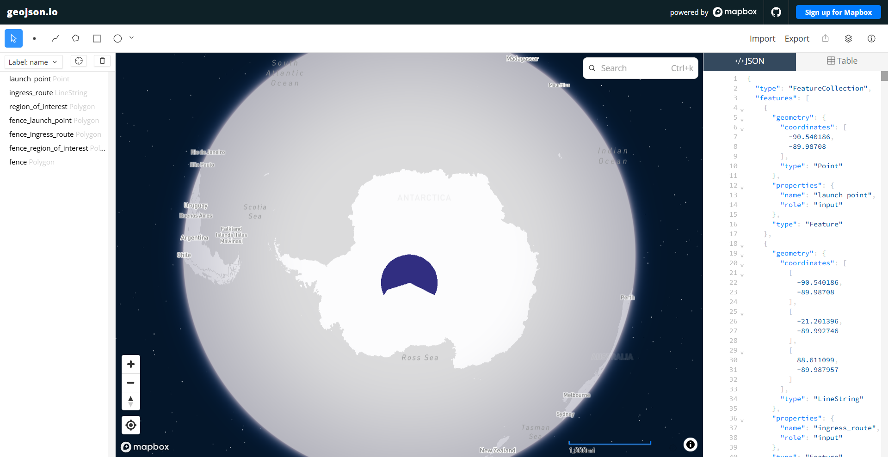

# Penguin Fence

[](https://github.com/jim-koch-atlanta/gtri-penguin-fence/actions/workflows/main.yaml)

Given a launch point, an ingress route, and a region-of-interest polygon in WGS84,
this tool computes a mission **geofence** — the union of a 200 m buffer around the
launch, a 100 m buffer around the route, and a 250 m buffer around the ROI — and
emits it as GeoJSON. The mission is *Operation Waddle Watch*, a penguin-colony
census near the South Pole; the 250 m ROI buffer doubles as a wildlife-disturbance
standoff, the one requirement the penguins would actually file a complaint about.

## Look at the coordinates

`89.987080 S` · `89.992746 S`. The mission sits within ~1 km of the **South Pole**
— and that is the whole problem. Near the pole, latitude/longitude stops behaving
like a coordinate grid: meridians converge, a 200 m circle is not a circle in
lat/lon, and "just buffer the points" produces geometry that is wrong by
kilometres.

The two-panel figure is the argument:



- **Left — the solution.** Every geometry re-projected into a mission-local
  Azimuthal Equidistant (AEQD) metres frame. The fence is the ~2.3 km shape it
  actually is, the buffers are round, and the South Pole sits *outside* the fence,
  ~570 m off the ingress route.
- **Right — the lesson.** The *same* GeoJSON drawn naively in raw lon/lat: a 2.3 km
  fence smeared across ~230° of longitude. Plausible-looking axes, completely wrong
  geometry.

A third view — the same *correct* GeoJSON opened in geojson.io — teaches two
**separate** lessons at once:



1. **Densification — mine to fix.** Before I densified the fence edges, a few long
   AEQD segments inverse-projected into wild lon/lat chords and the fence rendered
   continent-sized. Densifying at 10 m *before* the inverse transform fixed it —
   the geometry was right, the sparse vertices weren't.
2. **Renderer clamp — not mine to fix.** Even with provably-correct GeoJSON, Web
   Mercator (geojson.io, Mapbox) clamps at ±85.0511° latitude, so the South Pole is
   literally unrenderable there. The output is correct; the *renderer* cannot draw
   the pole. (This is exactly why the browser demo target is McMurdo, not the pole —
   see [below](#same-tool-different-continent).)

## Quickstart

Requires CMake ≥ 3.24, a C++20 compiler, and the geospatial libraries:

```bash
sudo apt-get update && sudo apt-get install -y libproj-dev libgeos-dev libgdal-dev
```

Build and test — 53 GoogleTest cases, GoogleTest fetched via CMake:

```bash
cmake -S . -B build
cmake --build build -j
ctest --test-dir build --output-on-failure     # 53/53
```

Run it on a mission file (see [Input format](#input-format)):

```bash
./build/src/penguin_fence_app data/input.json docs/mission.geojson
```

The emitted **[docs/mission.geojson](docs/mission.geojson)** — a `FeatureCollection`
of the three inputs, the three component buffers, and the union fence — is committed
so the output can be inspected without a build.

Regenerate the figure (viz layer needs `python3-pyproj` + `python3-matplotlib`; see
[`viz/README.md`](viz/README.md) for a portable setup):

```bash
sudo apt-get install -y python3-pyproj python3-matplotlib   # once
python3 viz/plot_mission.py                                 # docs/mission.geojson -> docs/figure.png
```

## Input format

A mission file is JSON with three keys — `launchPoint`, an `ingressRoute` polyline,
and a `regionOfInterest` closed ring. Each coordinate is a four-token string:

```
<latitude> <N|S> <longitude> <E|W>
```

e.g. `89.987080 S 90.540186 W` → 89.987080° S, 90.540186° W. Decimal degrees, WGS84;
latitude 0–90 with `N`/`S`, longitude 0–180 with `E`/`W` (case-insensitive), the
hemisphere letter carrying the sign; the ROI's last vertex repeats its first. Full
example: [`data/input.json`](data/input.json).

## How it works

The pipeline **centers itself on the mission**. Rather than hard-code a polar CRS,
it builds a local AEQD projection on the mission's own centroid — so the same code
is correct at the South Pole, at McMurdo, in Atlanta, or on the antimeridian. *The
South Pole isn't special; it's just where this mission happens to be.*

1. **Parse** the WGS84 mission (hemisphere-suffixed lat/lon).
2. **Centroid** via unit-vector spherical averaging — handles the ±180°
   antimeridian, where naive lat/lon averaging is meaningless.
3. **Construct** a local AEQD projection centered on that centroid.
4. **Project** to metres, **buffer** (200 / 100 / 250 m in GEOS), **union** the three.
5. **Inverse-project** back to WGS84 (densified, so pole-frame edges stay faithful).
6. **Emit** GeoJSON — union fence + component buffers + inputs, with a top-level
   `aeqd_center`.

Full design rationale, alternatives considered, and the verification plan:
**[docs/TECH_SPEC.md](docs/TECH_SPEC.md)**.

## Verification

Correctness near the pole is the riskiest claim, so it gets independent checks
(details in [TECH_SPEC §7](docs/TECH_SPEC.md)):

- **Geodesic ground truth — delivered.** Probe points placed at exact geodesic
  distances on the WGS84 ellipsoid, *independent of the AEQD projection*, confirm
  the buffer boundaries: 199 m in / 201 m out of the launch buffer, 99/101 for the
  route, 249/251 for the ROI, and a 5 km probe outside the union.
- **Structural sanity — delivered.** Closed rings at the pole, a valid GeoJSON
  `FeatureCollection` in [lon, lat], a 200 m launch-buffer spot-check, and
  projection round-trips plus the centroid holding at 89.99°S and across the
  antimeridian.
- **Cross-projection agreement & seam/validity assertions — specified, deliberately
  cut.** Re-running through EPSG:3031 and comparing fences (Hausdorff < 1 m), plus
  dedicated antimeridian-seam / `GEOSisValid` assertions — scoped, then consciously
  deferred for the take-home window. TECH_SPEC §7 states what each would add.

**53/53 tests**, `-Wall -Wextra` clean, with an ASan/UBSan/LeakSan gate run locally
(`cmake -S . -B build-asan -DPENGUIN_FENCE_SANITIZE=ON`). CI builds and tests on
every push (badge above).

## Same tool, different continent

The pipeline isn't pole-specific — the same binary runs a McMurdo Station mission
(77.85°S) with zero changes:

```bash
./build/src/penguin_fence_app data/mcmurdo.json docs/mcmurdo.geojson
```

`docs/mcmurdo.geojson` comes out in the identical schema (`aeqd_center` +
`{name, role}` features) — the same one the Q2 React/MapLibre client's mission layer
consumes — and, because McMurdo is inside Web Mercator's valid band, it renders
cleanly in a browser map where the pole mission cannot. The generality claim,
cashed: one tool, two continents, one schema.

## Repository tour

A reading order for review:

| Order | Path | What's there |
|---|---|---|
| 1 | `docs/TECH_SPEC.md` | design + verification plan — start here |
| 2 | `include/penguin_fence/` | the API surface: `parser` · `centroid` · `projection` · `geofence` · `geojson` |
| 3 | `src/penguin_fence/` | implementation, in pipeline order: parse → centroid → projection → geofence → geojson |
| 4 | `src/main.cpp` | the front door: parse a mission file → build the fence → emit GeoJSON |
| 5 | `tests/` | 53 GoogleTest cases (centroid, parser, projection, geofence, geojson, v2 geodesic probes) |
| 6 | `viz/` | the two-panel figure script |
| 7 | `docs/mission.geojson`, `docs/mcmurdo.geojson` | committed sample outputs |

## Build & repo decisions

- **Publishable-library layout (`include/` + `src/`).** Public headers separate from
  implementation — the shape a real distributable C++ library takes. Intentionally
  overkill for a nine-vertex take-home, adopted for clarity of intent (and ~free from
  the start); I skipped full `install()`/export packaging, which *would* be overkill
  here.
- **Nested CMake.** The root owns project-wide setup (C++20, warnings, testing); each
  directory owns the targets built from its own sources, so the build mirrors the
  source tree.
- **Warnings scoped to our code.** `-Wall -Wextra` on an `INTERFACE` target linked
  only to our targets, so fetched dependencies don't trip our warning budget.
- **GoogleTest via FetchContent**, pinned — reproducible test builds, no system
  dependency.
- **C++20**, no compiler extensions (`CMAKE_CXX_EXTENSIONS OFF`), for portability.
