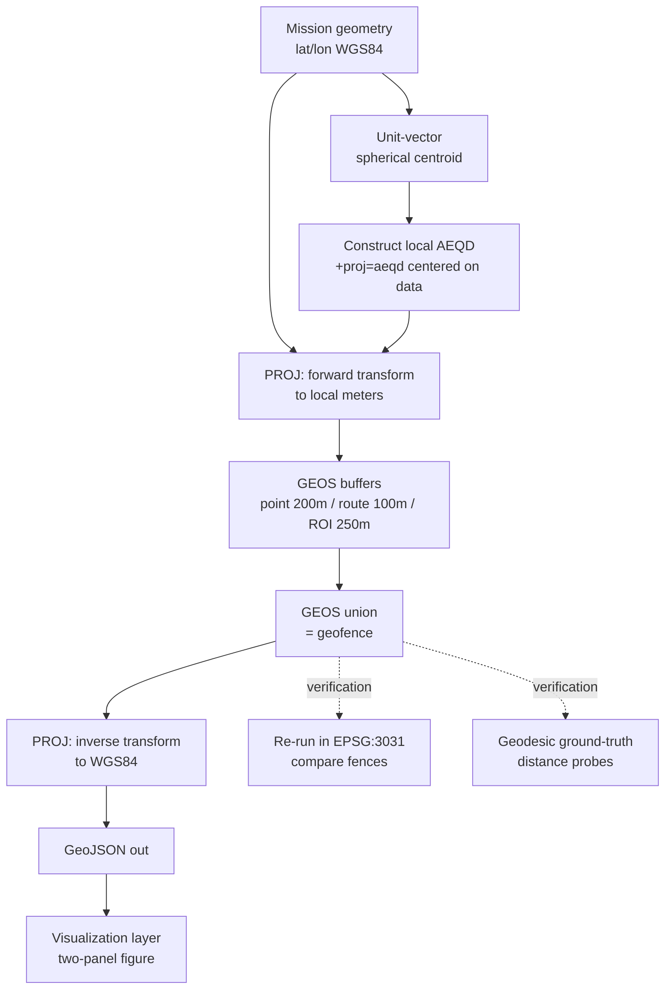

# Penguin Fence Tech Spec

**Author:** Jim Koch
**Date:** 2026-08-10
**Context:** GTRI Collaborative Autonomy second-level interview

---

## 1. Project Objective

A survey system supports a penguin colony census near the South Pole ("Operation Waddle Watch"). The mission planner defines a launch site, an ingress route, and a region of interest (the penguin colony). This tool computes the mission **geofence**: the union of a 200 m buffer around the launch site, a 100 m buffer around the ingress route, and a 250 m buffer around the region of interest — the last doubling as a wildlife-disturbance standoff zone, consistent with real Antarctic guidance.

## 2. Requirements

1. Accept the mission geometry as WGS84 geographic coordinates (lat/lon):
  * A launch point
  * An ingress route (polyline, 3 vertices)
  * A closed region-of-interest polygon (5 vertices, first == last).
2. Implement in C++, per the question's C++/C# options.
3. Compute a geofence comprising the **union** of:
  * **200 m buffer** around the **launch point**
  * **100 m buffer** around the **ingress route**
  * **250 m buffer** around the **region-of-interest**
4. Buffers must be **correct at the mission location**. The supplied mission sits near the South Pole, where Cartesian geometry fails.
5. Output the geofence in a standard, consumable format (GeoJSON; WGS84).
6. Produce a **representative visualization** demonstrating the solution.
7. Automated CI and test run (unit + integration) on every push.

## 3. Assumptions

1. **"A geofence" means one region.** The output is one *union* polygon. The visualization will additionally render the three component buffers distinguishably, so both readings of the question are satisfied.
2. **Compact mission areas.** The algorithm targets geographically compact inputs. Distortion across such a local extent is negligible -- distortion from treating a compact area as flat shrinks with the square of the area's size relative to Earth's radius; at ~2 km, it is far below our tolerance. This will be *verified* through automated tests. Continental or hemisphere-scale inputs are out of scope.
3. **Coordinates are WGS84.** They will be given as latitude followed by longitude, with hemisphere suffixes.
4. **Buffer distances are ground distances in meters.**
5. **Altitude is out of scope.** The geofence is 2-D. Vertical fencing is not considered.

## 4. Proposed Solution

**The algorithm centers itself on the reference points.** The presented scenario focuses on the South Pole. This is where treating lat / lon as Cartesian coordinates is most obviously wrong. We could choose a hard-coded CRS like Antarctic Polar Stereographic, but this would not generalize to other use cases.

Instead, the algorithm will construct a local projection centered on the mission, so this same solution will work at the poles, in Atlanta, or on the anti-meridian.

### Pipeline

1. **Parse** mission geometry (lat/lon, hemisphere-signed).
2. **Spherical centroid** of all mission vertices via **unit-vector averaging**: each (lat, lon) → (x, y, z) on the unit sphere; average; normalize; convert back. This is necessary, since the mission's longitudes span the full -180° to 180° range, so naive lat/lon averaging is meaningless.
3. **Construct a local Azimuthal Equidistant (AEQD) projection** centered on the centroid via PROJ: `+proj=aeqd +lat_0=<lat> +lon_0=<lon> +datum=WGS84 +units=m`. AEQD preserves distances along rays from its center — a good fit for buffering around a compact site, and dynamically constructible anywhere on Earth.
4. **Project** all geometry into local meters (PROJ).
5. **Buffer** in projected meters (GEOS): point + 200 m, polyline + 100 m, polygon + 250 m.
6. **Union** the three buffers (GEOS) to produce the geofence.
7. **Inverse-project** the fence (and components) back to WGS84.
8. **Emit** GeoJSON: the geofence + the three component buffers + the input geometry, for downstream use and for the visualization layer.

### Design diagram

## 5. Alternate Solutions (considered, not chosen)

1. **Hardcode EPSG:3031 (Antarctic Polar Stereographic).** Correct for *this* mission; fails the moment the mission moves. **NOTE**: We will use EPSG:3031 for testing & verification of the Azimuthal Equidistant algorithm.
2. **C# + NetTopologySuite.** While it is a legitimate option, C++ was chosen based on strongest past experience, along with light familiarity with GDAL / GEOS / PROJ.
3. **Spherical geometry throughout (Google S2).** The cleanest answer for a *globally generic* geofencing library — no projection selection at all. Out of scope for a mission-planning tool with compact inputs; named honestly as the right tool if Assumption #2 ever breaks.
4. **Hand-rolled buffering/offsetting.** The question explicitly welcomes libraries; re-implementing robust polygon offsetting is high-risk, low-reward.

## 6. Languages, Frameworks, Third-Party Libraries

- **C++20**, CMake build.
- **CI:** GitHub Actions workflow. *Very* lightweight: build + unit tests + integration tests on every push.
- **PROJ** — CRS construction, forward/inverse transforms, geodesic distance.
- **GEOS** — buffering, union, geometric predicates (via the stable C API).
- **GDAL/OGR** — GeoJSON I/O convenience.
- **Visualization layer:** small Python/matplotlib script consuming the GeoJSON — plots projected meters directly.

## 7. Verification Plan

From my past experience, any verification must confirm the riskiest assumption. In this case, we need to verify **correctness at the poles** (89.99°S).

This will be accomplished in three separate ways:

1. **Cross-projection agreement.** Run the same solution with the dynamic Azimuthal Equidistant *and* EPSG:3031. These are two entirely different projection families -- equidistant vs conformal stereographic. Because they distort differently, agreement would be meaningful.

We will verify that the two fences agree within a specific tolerance. Target: < 1m difference per vertex; < 0.1% difference in area.

2. **Geodesic ground truth.** Validate points at known geodesic distances computed by PROJ's geodesic routines, *independent of any projection*: a point 99 m from the ingress route lies **inside** the fence; 101 m lies **outside** the ingress route's buffer; likewise 199/201 m for the launch buffer and 249/251 m for the ROI; one distant point verified outside all three buffers, asserted outside the fence.

3. **Structural sanity.**
* The mission's antimeridian-spanning segments buffer without seam artifacts.
* The fence is a valid geometry.
* The pole itself is handled.

**Unit tests:**
* Unit-vector centroid (incl. the ±180° case: averaging 179°E and 179°W must NOT yield ~0°)
* Hemisphere-suffix parsing
* Axis-order round-trip through every I/O boundary
* Buffer distance spot-checks

## 8. Visualization Plan

A **two-panel figure**:
- **Panel A (the solution):** the mission rendered in the local polar view — launch, route, ROI, the three component buffers (distinguishable), and the union geofence. Sensible shapes around a pole.
- **Panel B (the lesson):** the same geometry drawn naively in plate carrée — smeared across the entire longitude axis. This panel is the one-image answer to *why this question is set at the South Pole*.

## 9. Scope Boundaries / Definition of Done

**Done:**
  * Correct fence for the supplied mission
  * All three verification steps green in CI
  * GeoJSON emitted
  * Two-panel figure produced
  * README walkthrough written

**Deliberately out of scope:**
  * Interactive map UI (Q2's territory)
  * Altitude / 3-D fencing
  * Config systems
  * CLI polish beyond argument parsing
  * S2 / global-scale support
  * Performance tuning (the dataset is 9 vertices).

**If time permits**:
  * Expand visualization to a true mapping solution (WinTAK, OSM)
  * Allow drag-and-drop placement of mission points

## 10. Open Questions / Flagged for the Committee

1. **"A geofence" — union vs. three zones.** Decided: union as the deliverable, components rendered. Happy to discuss whether operational consumers want per-zone semantics (e.g., differing altitude floors per zone).
2. **Buffer semantics.** Buffers computed in local projected meters; over this extent, projected-vs-geodesic disagreement is far below tolerance (verified by V1/V2). At larger extents the distinction becomes real — noted, out of scope.
3. **Geofence consumers.** Output is GeoJSON/WGS84; if the fleet expects a specific format (e.g., MAVLink fence protocol items), that's a thin exporter away — flagging rather than guessing.